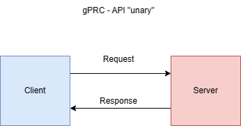

RPC = remote procedure call gRPC = trafega pelo HTTP2 O que ele trafega? Protocol buffers

## Protocol buffers

Protocol buffers are Google’s language-neutral, platform-neutral, extensible mechanism for serializing structured data – think XML, but smaller, faster, and simpler. <br> Dados trafegam em binarios e a chamada funciona com "contratos", igual no xml. Precisa da serializacao dos dados para virar binario e desserializacao para ler a msg.

### Protocol buffers vs JSON

-   JSON > arquivos binarios
-   Processo de serializacao eh mais leve (CPU) do que JSON
-   Gasta menos recusos de rede

```
message SearchRequest {
  string query = 1;
  int32 page_number = 2;
  int32 results_per_page = 3;
}
1, 2, 3 eh a ordem dos parametros. Usado para controle interno do gRPC
```

### HTTP/2

-   Utilia a mesma conexao TCP pra enviar e receber dados do lciente e do servidor (Multiplexer)
-   Server push

### Formatos de comunicação

#### gRPC - APi "unary"



tipo basico de comunicacao client<> server, parecido com chamadas Rest.

#### gRPC - APi Server Streaming


Ocorre diversas responses conforme a informacao vai sendo processada. Processa as informacoes pelo client antes mesmo que o server processe e termine todas as infos

#### gRPC - APi Client Streaming

 quando vc tem um payload mt grande, ao inves de jogar tudo de uma vez, vc vai enviando pequenas requisicoes para o server para poder processar e devolver uma UNICA resposta

#### gRPC - APi Bi directional Streaming

Tanto o client como o server manda dados de maneira continua.

---

| REST                              | gRPC                       |
| --------------------------------- | -------------------------- |
| Text/JSON                         | Protocol Buffers           |
| Unidirecional                     | Bidirecional e Assync      |
| Alta latencia                     | Baixa latencia             |
| Sem contrato                      | Contrato definido (.proto) |
| Sem suporte a streaming (Req/Res) | Suporta streaming          |
| Design pre-definido               | Design livre               |

https://grpc.io/docs/languages/go/quickstart/

```
protoc --go_out=. --go-grpc_out=.  ./proto/course_category.proto
```

<p> 
Ao gerar o codigo, tera a interface que conecta o gRPC e o service, o CategoryServiceServer interface.
Dentro do arquivo, vai ter um struct chamado UnimplementedCategoryServiceServer que aplica o CreateCategory com um return "method CreateCategory not implemented" que ingloba a interface CategoryServiceServer.

Copia os parametros dessa funcao e coloca no service.go e Devemos retornar a info a partir do que foi colocado no .proto em CategoryResponse

</p>

### servidor gRPC

instala o https://github.com/ktr0731/evans

-   Motivo: created to use easier than other existing gRPC clients

```
<!-- Criar tablea de categorias -->
sqlit3 data.db
create table categories (id stirng, name string, descirption string )

<!-- evans -->
evans -r repl
<!-- seleciona o servico que deseja -->
service CategoryService
call CreateCategory
```
