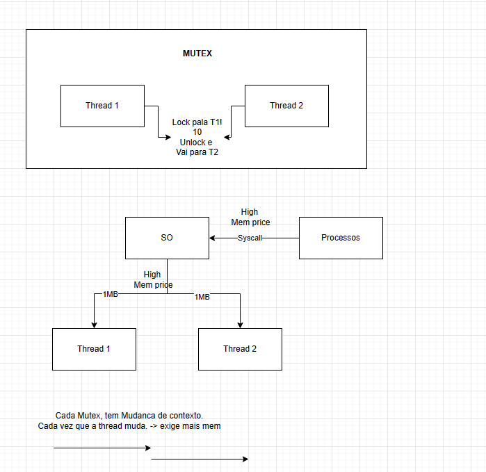

## Concorrente e paralelismo tradicional:

### Concorrencia

-   As coisas nao acontecem ao mesmo tempo

-   Nao precisa esperar terminar para comecar a outra

-   Ex: 2 pizzaiolos para 1 lugar de abrir massa.

Os Schedulers que controlam as streads podem ser: _ Preemptivos: Tempo determinado por cada tarefa _ Cooperativo: Espera uma tarefa acabar para comecar outra

### Paralelismo

-   Depende da quantidade de CPU. +1core, os processos ocorrem de maneira concorrente e paralelas por default
-   As tarefas ocorrem de forma paralelas

-   Ex: 2 pizzaiolos para 2 tabuas

## Com Golang
